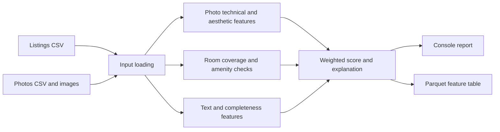

# Trevo Listing Quality Score Engine

**Prepared by Zaynab AITADDI**

**Trevo internship project · Project A**

A Python batch application that scores vacation-rental listing content for cold-start ranking, when booking history is sparse or unavailable. It analyzes listing text, metadata, and photos, then produces a weighted score from 0 to 100 with component scores and plain-language explanations.

This repository is the standalone **Project A quality engine**. It reads the supplied local data package and does not connect to Trevo production services.

## Status

| Area                                                                                                             | State                                                                                                                  |
| ---------------------------------------------------------------------------------------------------------------- | ---------------------------------------------------------------------------------------------------------------------- |
| Engine (ingestion, six components, weighted score, explanations)                                                 | Implemented and runnable                                                                                               |
| Feature-table contract and validator                                                                             | Implemented (`quality-v1`)                                                                                             |
| Automated tests                                                                                                  | 23 test functions in 5 files                                                                                           |
| Model evaluation (room accuracy, blur precision, aesthetic calibration, rank check, Moroccan-interiors analysis) | **Not yet run.** Tooling exists; labeled sets and results do not. See [Scope and Limitations](#scope-and-limitations). |
| Weight allocation                                                                                                | **Differs from the brief's Figure 2** and needs to be confirmed. See [Known issues](#known-issues).                    |

## At a Glance

- **Input:** listing and photo CSVs plus local photo files.
- **Processing:** image-quality checks, room classification, optional amenity vision, text signals, and listing completeness.
- **Output:** one explainable feature row per eligible listing, written as Parquet.
- **Runtime:** Python 3.10+, CPU supported, no GPU required.
- **Interface:** the versioned feature-table contract in [CONTRACT.md](CONTRACT.md).



## Quick Start

Requirements: Python 3.10 or newer. The project uses PyTorch and OpenCLIP, so installation can take time and disk space. A GPU is not required.

### Windows (PowerShell)

Open PowerShell in the repository root, the directory containing `pyproject.toml`.

```powershell
python --version
python -m venv .venv
.\.venv\Scripts\Activate.ps1
python -m pip install --upgrade pip
python -m pip install -e ".[dev]"
```

If script execution is blocked, run `Set-ExecutionPolicy -Scope Process -ExecutionPolicy Bypass` once in the same window, then activate again.

### macOS / Linux

```bash
python3 --version
python3 -m venv .venv
source .venv/bin/activate
python -m pip install --upgrade pip
python -m pip install -e ".[dev]"
```

All commands below assume the virtual environment is **activated** in the current terminal. The Windows form is shown; on macOS/Linux use the same commands, replacing `$env:NAME = "value"` with `export NAME=value` and backslashes in paths with forward slashes.

### Check the data

The scorer expects these paths:

```text
data/
  listings.csv
  photos.csv
  photos/...
```

`listings.csv` must have a `listing_id` column. `photos.csv` must have `entity_id` and `file` columns. Photo file paths are resolved relative to `data/`. The provided data package and photos are private project data and are not tracked by Git. If Trevo supplied `ranking-data.zip` in the repository root, extract it locally:

```powershell
Expand-Archive -LiteralPath .\ranking-data.zip -DestinationPath .\data -Force
```

```bash
unzip -o ranking-data.zip -d data
```

Make sure the CSVs end up directly in `data/`.

### Score five listings

For room and amenity vision, enable OpenCLIP:

```powershell
$env:QUALITY_ENGINE_USE_CLIP = "1"
python -m quality_engine.run --limit 5 --output .\output\sample.parquet
```

The command prints a ranked report and saves `output/sample.parquet`. The first OpenCLIP run may download pretrained weights; later runs use the local cache. Inference runs locally. A Hugging Face unauthenticated-request warning is about download rate limits, not listing data.

To score all eligible listings, omit `--limit`:

```powershell
python -m quality_engine.run --output .\output\features.parquet
```

The default output is `output/features.parquet`. To see all options:

```powershell
python -m quality_engine.run --help
```

### CLIP settings

`QUALITY_ENGINE_USE_CLIP` controls the vision models:

| Value | Room classification       | Amenity check                     |
| ----- | ------------------------- | --------------------------------- |
| `1`   | OpenCLIP                  | OpenCLIP                          |
| `0`   | Filename hints (fallback) | Neutral score of 50               |
| unset | OpenCLIP (default on)     | Neutral score of 50 (default off) |

Because the two defaults differ, **always set the variable explicitly** and record its value next to any score you report. The same listings can score several points apart depending on this setting.

For offline fallback testing:

```powershell
$env:QUALITY_ENGINE_USE_CLIP = "0"
python -m quality_engine.run --limit 5 --output .\output\fallback.parquet
```

The filename fallback is not equivalent to visual classification.

### Run checks

```powershell
python scripts\validate_feature_table.py .\output\features.parquet
python -m pytest -q
python -m ruff check src tests scripts
```

## Sample Output

A five-listing run with room classification on OpenCLIP and amenity vision off (so every amenity score is the neutral 50):

| Listing  | Score | Tech | Aesth | Rooms | Amen | Text | Complete | Level      |
| -------- | ----: | ---: | ----: | ----: | ---: | ---: | -------: | ---------- |
| lst_0001 |  77.6 | 79.5 |  85.9 |  80.0 | 50.0 | 57.3 |     90.9 | GOOD       |
| lst_0002 |  63.6 | 51.5 |  79.4 |  60.0 | 50.0 | 57.3 |     72.7 | NEEDS WORK |
| lst_0003 |  66.4 | 61.5 |  84.8 |  60.0 | 50.0 | 57.3 |     72.7 | GOOD       |
| lst_0004 |  66.2 | 58.3 |  87.6 |  60.0 | 50.0 | 57.3 |     72.7 | GOOD       |
| lst_0005 |  75.9 | 64.9 |  93.1 | 100.0 | 50.0 | 80.7 |     72.7 | GOOD       |

This illustrates the output shape. Five listings are not a statistical evaluation of the engine.

## How Scoring Works

Each component is scored on a 0–100 scale. The configured component weights are applied to calculate the final score; weights are stored in [config/weights.yaml](config/weights.yaml), not embedded in the scoring formula. The weights are validated on every run: all six keys must be present, every weight must be finite and non-negative, and the total must be exactly 100.

| Component       | Weight | Signal                                                                                                     |
| --------------- | -----: | ---------------------------------------------------------------------------------------------------------- |
| Photo technical |    20% | Blur/sharpness, exposure, resolution, and near-duplicate photos. OpenCV and perceptual hashing.            |
| Photo aesthetic |    15% | Current heuristic uses colorfulness, contrast, and sharpness; optional linear calibration can be applied.  |
| Room coverage   |    10% | OpenCLIP zero-shot room classification when enabled; filename fallback otherwise.                          |
| Amenity check   |    10% | OpenCLIP visual detections compared with declared amenities; neutral when visual detection is unavailable. |
| Text quality    |    15% | Heuristic language markers, title length, and description length.                                          |
| Completeness    |    30% | Listing fields, amenity count relative to capacity, price, and calendar/availability fields.               |

Thresholds are in `config/thresholds.yaml`; model settings are in `config/models.yaml`; room and amenity labels/prompts are in `config/room_labels.yaml`.

### Component formulas

```text
technical    = clamp(0.35 * sharpness + 0.25 * exposure + 0.25 * resolution
                     - min(8 * duplicate_groups, 25), 0, 100)
aesthetic    = 100 * (0.35 * min(colorfulness / 40, 1)
                      + 0.35 * min(contrast / 60, 1)
                      + 0.30 * min(sharpness / 150, 1))     # then optional calibration
room         = 100 * (required rooms covered) / 5           # bedroom, bathroom, kitchen, living, exterior
text         = 0.4 * language_coverage + 0.4 * length_score + 0.2 * title_score
completeness = 100 * (checks passed) / 11
final        = round(clamp(sum(component_i * weight_i) / 100, 0, 100), 2)
```

A room type counts as covered only when the classifier confidence is at least 0.25. An amenity counts as detected when its probability is at least 0.22.

### Image processing performance

Independent photo analysis uses four worker threads by default, while OpenCV itself defaults to one thread to avoid CPU oversubscription. These controls do not change the scoring formulas. To tune them for a different computer, set positive integer values before running:

```powershell
$env:QUALITY_ENGINE_IMAGE_WORKERS = "6"
$env:QUALITY_ENGINE_OPENCV_THREADS = "1"
```

The first model-enabled run can take longer due to weight download and initialization.

## Inputs

The loader recognizes these listing fields when present: `listing_id`, `vertical`, `name`, `description`, `city`, `country`, `capacity`, `bedrooms`, `bathrooms`, `base_price`, `currency`, `instant_booking`, `is_calendar_synced`, `has_active_ical`, `pricing_days_180`, `blocked_days_180`, `amenities`, `photo_count`, `property_type`, and `status`. Blank optional values receive defaults. Amenity lists are accepted as JSON, Python literals, or pipe-separated text. Listings with a blank `vertical` or `vertical=stay` are eligible; other verticals are skipped.

Photo records use `entity_id`, `file`, and optional `seq`, `is_cover`, `width`, `height`, and `bytes`. Listing/photo association uses a trailing numeric ID (for example, `lst_0001` matches `adv_0001`). Unreadable or missing photos do not stop the batch, but their image signals cannot contribute normally.

The CLI options are:

| Option          | Default                   | Meaning                                                                      |
| --------------- | ------------------------- | ---------------------------------------------------------------------------- |
| `--data PATH`   | repository `data/`        | Directory containing the two CSVs and referenced image files.                |
| `--limit N`     | all records               | Maximum source listing records to consider. Non-stay records may be skipped. |
| `--output PATH` | `output/features.parquet` | Destination Parquet file; parent folders are created automatically.          |

## Output and Console Report

The output table contains one row per eligible listing. Its required columns and versioning rules are documented in [CONTRACT.md](CONTRACT.md). Each row includes:

- `listing_id` and the overall `quality_score`.
- The six component scores: `photo_technical`, `photo_aesthetic`, `room_coverage`, `amenity_check`, `text_quality`, and `completeness`.
- `photo_status`, schema/engine/config versions, and `explanation_json` with strengths, issues, suggestions, and photo flags.

In the console, `SCORE` is the weighted total. Levels are `EXCELLENT` (80+), `GOOD` (65–79.9), `NEEDS WORK` (50–64.9), and `LOW` (below 50). Component abbreviations are `TECH`, `AESTH`, `ROOMS`, `AMEN`, `TEXT`, and `COMPLETE`.

Photo flags distinguish the technical issue from the room classifier's guess. For example, `Below configured resolution target; room guess: living room (46% classifier confidence); 1440 x 648 px (0.93 MP)` means the image is below the configured resolution threshold, and the classifier's top room category was living room. The percentage is model confidence in that category, not photo quality or a calibrated probability. `Unknown room` means a recognized room category did not meet the confidence threshold; the top guess is shown when available. A blur flag is a separate technical signal.

The configured resolution scale uses 0.3 megapixels as its minimum and 2 megapixels as its good target. The current report flags images below a normalized resolution score of 40; this is a project threshold, not a universal definition of an unusable photo. A neutral amenity score means vision was unavailable, not that declared amenities were visually confirmed.

To inspect or validate an output file:

```powershell
python scripts\show_features.py --path .\output\features.parquet
python scripts\validate_feature_table.py .\output\features.parquet
```

The validator checks required columns, unique/non-empty IDs, numeric score ranges and finiteness, explanation JSON, and weight configuration. It validates table structure, not model accuracy.

Saved `bad_photos` entries can contain absolute local file paths. Strip or relativize them before a feature table leaves the machine it was produced on.

## Evaluation Utilities

Evaluation scripts operate on locally prepared labels. Keep the labels and images private and use the approved project workflow.

Room-label CSV format:

```csv
photo_file,label
photos/adv_0001/photo1.jpg,bedroom
```

Blur labels use the same columns, with values such as `blurry` and `sharp`. Run the room classifier and the combined evaluation gates with:

```powershell
python scripts\evaluate_room_classifier.py .\private-eval\room_labels.csv --photos-root .\data
python scripts\evaluate_quality_gates.py --room-labels .\private-eval\room_labels.csv --blur-labels .\private-eval\blur_labels.csv --photos-root .\data
```

The brief's evaluation targets are at least 85% room accuracy and 90% blur precision. The scripts calculate metrics; a target is not considered achieved until it has been measured on an appropriate held-out labeled set.

The aesthetic calibration tool accepts `photo_file` plus either `avg_rating` or both `rater1` and `rater2`:

```powershell
python scripts\calibrate_aesthetic_model.py --csv .\private-eval\aesthetic_ratings.csv
```

It writes `artifacts/aesthetic_calibrator.yaml` by default. No rating data or evaluation results are included in this repository.

## Scope and Limitations

This repository implements the Python **Project A** quality engine only. It does not include Project B's TypeScript ranking library or its synthetic event generator, golden-query harness, replay tool, or demo UI.

- **Aesthetic:** the component is a heuristic, not a pretrained aesthetic predictor validated against human ratings.
- **Room classifier:** the fallback uses filename hints, not a classifier trained on cached embeddings. The brief's fallback for accuracy below 85% is not implemented.
- **Amenity detection:** amenity probabilities come from a softmax across all amenity prompts, so they compete with each other. This suits picking one label better than answering "is there a TV?", and the 0.22 threshold has not been tuned on labeled photos.
- **Text language:** language detection uses marker words and the Arabic Unicode block, not a language-identification model. Short common words can cause false matches.
- **Completeness:** amenity expectation is adjusted by capacity (3, 5 or 7 amenities), not compared with real peer listings by vertical and capacity.
- **Blur:** the Laplacian variance depends on image size and content, so plain walls or soft lighting can be mislabeled. Precision has not been measured.
- **Evaluation:** evaluation tools are present, but this repository does not contain labeled sets or evidence that the 85% room-accuracy and 90% blur-precision targets have passed. It also does not contain the brief's two-rater ranking comparison for 30 listings or the Moroccan-interior error analysis.

## Known Issues

These are recorded as-is and should be resolved before the score is described as final.

1. **Weight allocation differs from the brief.** Figure 2 of the brief gives technical 25, aesthetic 15, room coverage 20, amenity check 10, text quality 20, completeness 10. The current `config/weights.yaml` uses 20 / 15 / 10 / 10 / 15 / 30. Both total 100, so validation passes. The brief's "photo signals carry 40 points" refers to technical plus aesthetic (25 + 15); room coverage and amenity check are separate components. Aligning the file changes every score and requires a contract version bump.
2. **The technical component is capped at 85.** Its sub-signal coefficients (0.35 + 0.25 + 0.25) sum to 0.85, so even a perfect gallery cannot reach 100 on this component.
3. **A declared amenity that is not detected is penalized twice:** it lowers the match ratio and also costs 3 points. This is heavier than the mild treatment the brief describes.
4. **The CLIP defaults differ** between room vision (on) and amenity vision (off) when `QUALITY_ENGINE_USE_CLIP` is unset.

## Data Handling

Keep this repository private. Do not commit raw listing data or photos, attempt re-identification, or upload Trevo listing content to public repositories, public model hubs, or third-party labeling services. OpenCLIP downloads pretrained model weights; model inference runs locally. Treat generated feature tables, evaluation labels, calibration files, and any artifacts derived from Trevo data as private, and follow the project's retention/deletion requirements.

## Repository Layout

```text
config/                  Weights, thresholds, model settings, and prompts
data/                    Private local input CSVs and photos; not tracked by Git
output/                  Generated feature tables; not tracked by Git
scripts/                 Profiling, calibration, evaluation, display, validation
src/quality_engine/      Project A ingestion, features, scoring, and CLI
tests/                   Automated tests
CONTRACT.md              Feature-table interface and versioning rules
pyproject.toml           Package metadata and tool configuration
```
