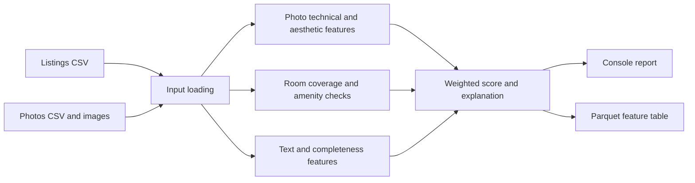

# Trevo Listing Quality Score Engine

**Prepared by Zaynab AITADDI**

**Trevo internship project · Project A**

A Python batch application that scores vacation-rental listing content for cold-start ranking, when booking history is sparse or unavailable. It analyzes listing text, metadata, and photos, then produces a weighted score from 0 to 100 with component scores and plain-language explanations.

This repository is the standalone **Project A quality engine**. It reads the supplied local data package and does not connect to Trevo production services.

## At a Glance

- **Input:** listing and photo CSVs plus local photo files.
- **Processing:** image-quality checks, room classification, optional amenity vision, text signals, and listing completeness.
- **Output:** one explainable feature row per eligible listing, written as Parquet.
- **Runtime:** Python 3.10+, CPU supported, no GPU required.
- **Interface:** the versioned feature-table contract in [CONTRACT.md](CONTRACT.md).



## Run on Windows

Open PowerShell in the repository root, the directory containing `pyproject.toml`.

### Install

Python 3.10 or newer is required:

```powershell
python --version
python -m venv .venv
& .\.venv\Scripts\python.exe -m pip install --upgrade pip
& .\.venv\Scripts\python.exe -m pip install -e ".[dev]"
```

The project uses PyTorch and OpenCLIP, so installation can take time and disk space. A GPU is not required.

### Check the data

The scorer expects these paths:

```text
data/
  listings.csv
  photos.csv
  photos/...
```

`listings.csv` must have a `listing_id` column. `photos.csv` must have `entity_id` and `file` columns. Photo file paths are resolved relative to `data/`. The provided data package and photos are private project data and are not tracked by Git. If Trevo supplied `ranking-data.zip` in the repository root, extract it locally:

```powershell
Expand-Archive -LiteralPath .\ranking-data.zip -DestinationPath .\data -Force
```

Make sure the CSVs end up directly in `data/`. More details are in [data/README.md](data/README.md).

### Score five listings

For room and amenity vision, enable OpenCLIP:

```powershell
$env:QUALITY_ENGINE_USE_CLIP = "1"
python -m quality_engine.run --limit 5 --output .\output\sample.parquet
```

The command prints a ranked report and saves `output/sample.parquet`. The first OpenCLIP run may download pretrained weights; later runs use the local cache. Inference runs locally. A Hugging Face unauthenticated-request warning is about download rate limits, not listing data.

To score all eligible listings, omit `--limit`:

```powershell
python -m quality_engine.run --output .\output\features.parquet
```

The default output is `output/features.parquet`. To see all options:

```powershell
python -m quality_engine.run --help
```

For offline fallback testing, disable CLIP:

```powershell
$env:QUALITY_ENGINE_USE_CLIP = "0"
python -m quality_engine.run --limit 5 --output .\output\fallback.parquet
```

With CLIP disabled, room labels fall back to filename hints and amenity vision uses a neutral score. This fallback is not equivalent to visual classification.

### Run checks

```powershell
python scripts\validate_feature_table.py .\output\features.parquet
python -m pytest -q
python -m ruff check src tests scripts
```

## How Scoring Works

Each component is scored on a 0–100 scale. The configured component weights are applied to calculate the final score; weights are stored in [config/weights.yaml](config/weights.yaml), not embedded in the scoring formula.

| Component       | Weight | Signal                                                                                                     |
| --------------- | -----: | ---------------------------------------------------------------------------------------------------------- |
| Photo technical |    20% | Blur/sharpness, exposure, resolution, and near-duplicate photos. OpenCV and perceptual hashing.            |
| Photo aesthetic |    15% | Current heuristic uses colorfulness, contrast, and sharpness; optional linear calibration can be applied.  |
| Room coverage   |    10% | OpenCLIP zero-shot room classification when enabled; filename fallback otherwise.                          |
| Amenity check   |    10% | OpenCLIP visual detections compared with declared amenities; neutral when visual detection is unavailable. |
| Text quality    |    15% | Heuristic language markers, title length, and description length.                                          |
| Completeness    |    30% | Listing fields, amenity count relative to capacity, price, and calendar/availability fields.               |

Thresholds are in `config/thresholds.yaml`; model settings are in `config/models.yaml`; room and amenity labels/prompts are in `config/room_labels.yaml`.

### Image processing performance

Independent photo analysis uses four worker threads by default, while OpenCV itself defaults to one thread to avoid CPU oversubscription. These controls do not change the scoring formulas. To tune them for a different computer, set positive integer values before running:

```powershell
$env:QUALITY_ENGINE_IMAGE_WORKERS = "6"
$env:QUALITY_ENGINE_OPENCV_THREADS = "1"
```

The first model-enabled run can take longer due to weight download and initialization.

## Inputs

The loader recognizes these listing fields when present: `listing_id`, `vertical`, `name`, `description`, `city`, `country`, `capacity`, `bedrooms`, `bathrooms`, `base_price`, `currency`, `instant_booking`, `is_calendar_synced`, `has_active_ical`, `pricing_days_180`, `blocked_days_180`, `amenities`, `photo_count`, `property_type`, and `status`. Blank optional values receive defaults. Listings with a blank `vertical` or `vertical=stay` are eligible; other verticals are skipped.

Photo records use `entity_id`, `file`, and optional `seq`, `is_cover`, `width`, `height`, and `bytes`. Listing/photo association uses a trailing numeric ID (for example, `lst_0001` matches `adv_0001`). Unreadable or missing photos do not stop the batch, but their image signals cannot contribute normally.

The CLI options are:

| Option          | Default                   | Meaning                                                                      |
| --------------- | ------------------------- | ---------------------------------------------------------------------------- |
| `--data PATH`   | repository `data/`        | Directory containing the two CSVs and referenced image files.                |
| `--limit N`     | all records               | Maximum source listing records to consider. Non-stay records may be skipped. |
| `--output PATH` | `output/features.parquet` | Destination Parquet file; parent folders are created automatically.          |

## Output and Console Report

The output table contains one row per eligible listing. Its required columns and versioning rules are documented in [CONTRACT.md](CONTRACT.md). Each row includes:

- `listing_id` and the overall `quality_score`.
- The six component scores: `photo_technical`, `photo_aesthetic`, `room_coverage`, `amenity_check`, `text_quality`, and `completeness`.
- `photo_status`, schema/engine/config versions, and `explanation_json` with strengths, issues, suggestions, and photo flags.

In the console, `SCORE` is the weighted total. Levels are `EXCELLENT` (80+), `GOOD` (65–79.9), `NEEDS WORK` (50–64.9), and `LOW` (below 50). Component abbreviations are `TECH`, `AESTH`, `ROOMS`, `AMEN`, `TEXT`, and `COMPLETE`.

Photo flags distinguish the technical issue from the room classifier's guess. For example, `Below configured resolution target; room guess: living room (46% classifier confidence); 1440 x 648 px (0.93 MP)` means the image is below the configured resolution threshold, and the classifier's top room category was living room. The percentage is model confidence in that category, not photo quality or a calibrated probability. `Unknown room` means a recognized room category did not meet the confidence threshold; the top guess is shown when available. A blur flag is a separate technical signal.

The configured resolution scale uses 0.3 megapixels as its minimum and 2 megapixels as its good target. The current report flags images below a normalized resolution score of 40; this is a project threshold, not a universal definition of an unusable photo. A neutral amenity score means vision was unavailable, not that declared amenities were visually confirmed.

To inspect or validate an output file:

```powershell
python scripts\show_features.py --path .\output\features.parquet
python scripts\validate_feature_table.py .\output\features.parquet
```

The validator checks required columns, unique/non-empty IDs, numeric score ranges and finiteness, explanation JSON, and weight configuration. It validates table structure, not model accuracy.

## Evaluation Utilities

Evaluation scripts operate on locally prepared labels. Keep the labels and images private and use the approved project workflow.

Room-label CSV format:

```csv
photo_file,label
photos/adv_0001/photo1.jpg,bedroom
```

Blur labels use the same columns, with values such as `blurry` and `sharp`. Run the room classifier and the combined evaluation gates with:

```powershell
python scripts\evaluate_room_classifier.py .\private-eval\room_labels.csv --photos-root .\data
python scripts\evaluate_quality_gates.py --room-labels .\private-eval\room_labels.csv --blur-labels .\private-eval\blur_labels.csv --photos-root .\data
```

The brief's evaluation targets are at least 85% room accuracy and 90% blur precision. The scripts calculate metrics; a target is not considered achieved until it has been measured on an appropriate held-out labeled set.

The aesthetic calibration tool accepts `photo_file` plus either `avg_rating` or both `rater1` and `rater2`:

```powershell
python scripts\calibrate_aesthetic_model.py --csv .\private-eval\aesthetic_ratings.csv
```

It writes `artifacts/aesthetic_calibrator.yaml` by default. No rating data or evaluation results are included in this repository.

## Scope and Limitations

This repository implements the Python **Project A** quality engine only. It does not include Project B's TypeScript ranking library or its synthetic event generator, golden-query harness, replay tool, or demo UI.

The current aesthetic component is a heuristic, not a pretrained aesthetic predictor validated against human ratings. The room-classifier fallback uses filename hints, not a classifier trained on cached embeddings. Evaluation tools are present, but this repository does not contain labeled sets or evidence that the 85% room-accuracy and 90% blur-precision targets have passed. It also does not contain the brief's two-rater ranking comparison for 30 listings or Moroccan-interior error analysis.

There is one weight-allocation discrepancy to clarify against the project brief: the current weights assign 20 technical + 15 aesthetic + 10 room coverage + 10 amenity check = **55 points** to photo/image-related components, while the brief says photo signals carry 40 points. The current configuration is recorded as-is; the weight allocation should be confirmed before describing it as final.

## Data Handling

Keep this repository private. Do not commit raw listing data or photos, attempt re-identification, or upload Trevo listing content to public repositories, public model hubs, or third-party labeling services. OpenCLIP downloads pretrained model weights; model inference runs locally. Treat generated feature tables, evaluation labels, calibration files, and any artifacts derived from Trevo data as private, and follow the project's retention/deletion requirements.

## Repository Layout

```text
config/                  Weights, thresholds, model settings, and prompts
data/                    Private local input CSVs and photos; not tracked by Git
output/                  Generated feature tables; not tracked by Git
scripts/                 Profiling, calibration, evaluation, display, validation
src/quality_engine/      Project A ingestion, features, scoring, and CLI
tests/                   Automated tests
CONTRACT.md              Feature-table interface and versioning rules
pyproject.toml           Package metadata and tool configuration
```
